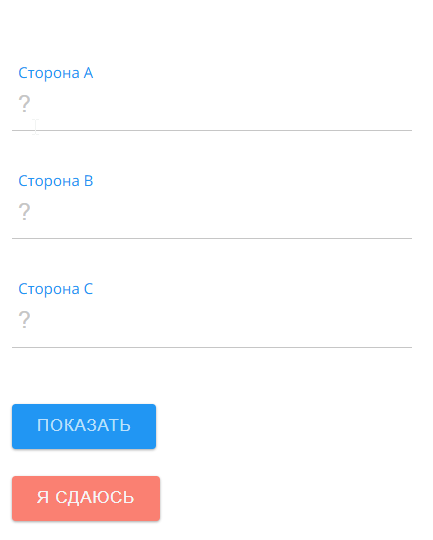
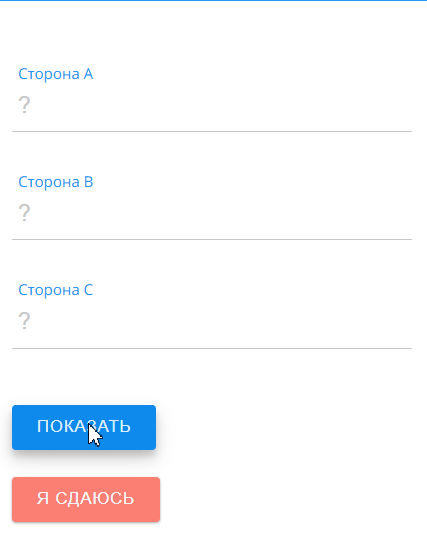
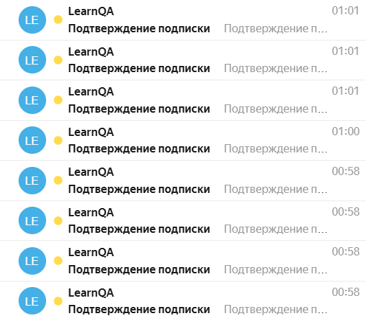
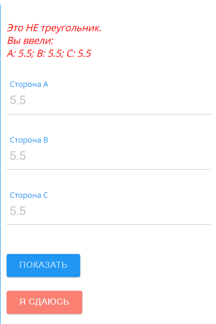
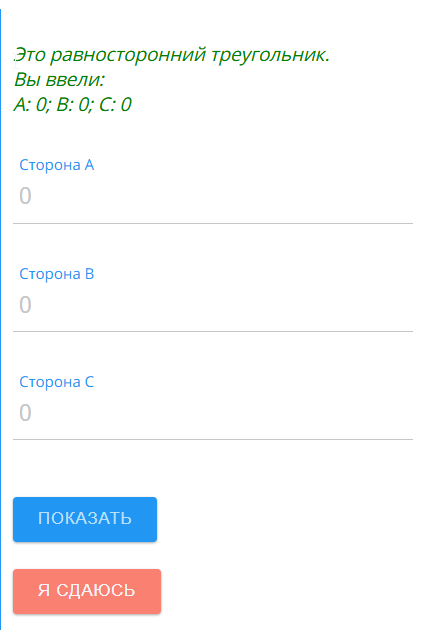

# Баг-репорты

Объект тестирования: [playground.learnqa.ru/puzzle/triangle](https://playground.learnqa.ru/puzzle/triangle)

---

## Баг #1: Отсутствие оповещения об ошибке при вводе символа "?"

**Окружение:** Windows 10 Домашняя 64-разрядная, Chrome v151.0.7922.138

**Предусловия:** Перейти на https://playground.learnqa.ru/puzzle/triangle

**Шаги воспроизведения:**
1. Ввести символ "?" в любое из полей со значением стороны треугольника
2. Ввести целые числа или символ "?" в остальные поля
3. Нажать кнопку "ПОКАЗАТЬ"

**Фактический результат:** Ничего не происходит, сообщение об ошибке не появляется

**Ожидаемый результат:** Должно появляться сообщение об ошибке, аналогичное реакции системы на другие невалидные значения

**Severity:** Trivial — дефект не оказывает сильного влияния на основной функционал системы

**Priority:** Low — баг не мешает основному сценарию использования, символ "?" маловероятен для случайного ввода реальным пользователем

**Вложения:**

---

## Баг #2: Отсутствие ограничения на количество отправок писем на один email

**Окружение:** Windows 10 Домашняя 64-разрядная, Chrome v151.0.7922.138

**Предусловия:** Перейти на https://playground.learnqa.ru/puzzle/triangle

**Тестовые данные:** test@test.ru

**Шаги воспроизведения:**
1. Ввести любой email в поле для ввода email
2. Нажать кнопку "Подписаться"
3. Обновить страницу
4. Повторить шаги 1-3 несколько раз

**Фактический результат:** Появляется сообщение "Подтверждение подписки. На указанный вами электронный адрес было выслано письмо со ссылкой для подтверждения подписки." Письма отправляются без ограничений — после каждого повтора на почту приходит новое письмо.

**Ожидаемый результат:** Ограничение количества отправок за определённый промежуток времени и/или капча после нескольких попыток

**Severity:** Major — дефект не затрагивает основную функциональность, но является потенциальной уязвимостью, которая может быть использована в целях спама

**Priority:** Medium — баг не мешает основному сценарию использования продукта, но может использоваться для спама, что может вызвать недовольство у конечного пользователя и потерю доверия к компании

**Вложения:**

---

## Баг #3: Форма для ввода значений неправильно работает с нецелыми числами

**Окружение:** Windows 10 Домашняя 64-разрядная, Chrome v151.0.7922.138

**Предусловия:** Перейти на https://playground.learnqa.ru/puzzle/triangle

**Тестовые данные:**
1) 3 одинаковых дробных числа с точкой (5.5) или запятой (5,5)
2) 3 дробных числа с точкой или запятой, формирующих математически правильный треугольник (1.5 / 2.5 / 3.5 или 1,5 / 2,5 / 3,5)

**Шаги воспроизведения:**
1. Ввести тестовые данные в поля для ввода значений сторон треугольника
2. Нажать кнопку "ПОКАЗАТЬ"

**Фактический результат:** При вводе дробных чисел (как через точку, так и через запятую) в любой комбинации — включая случаи, где стороны образуют математически корректный треугольник (например, 1.5 / 2.5 / 3.5) — появляется сообщение "Это НЕ треугольник"

**Ожидаемый результат:** Программа должна корректно определять тип треугольника при вводе дробных чисел, аналогично поведению с целыми числами

**Severity:** Critical — Дефект затрагивает основную функциональность

**Priority:** High — Основные функции программы не могут быть выполнены в полной мере

**Вложения:**

---

## Баг #4: Программа определяет треугольник с значениями сторон 0 как равносторонний

**Окружение:** Windows 10 Домашняя 64-разрядная, Chrome v151.0.7922.138

**Предусловия:** Перейти на https://playground.learnqa.ru/puzzle/triangle

**Тестовые данные:** 0

**Шаги воспроизведения:**
1. Ввести тестовые данные во все поля для ввода значений сторон треугольника
2. Нажать кнопку "ПОКАЗАТЬ"

**Фактический результат:** При вводе 0 во все поля значений сторон треугольника, программа определяет этот треугольник как равносторонний и появляется сообщение
"Это равносторонний треугольник.
Вы ввели:
A: 0; B: 0; C: 0"

**Ожидаемый результат:** Появляется сообщение о том, что такой треугольник не существует или, что все значения должны быть больше 0, или подобное сообщение об ошибке, аналогичное реакции системы на другие невалидные значения

**Severity:** Major — Часть функциональности работает некорректно, но система в целом остаётся работоспособной

**Priority:** Low — Вероятность использования такого сценария пользователем невелика, исправление бага можно отложить

**Вложения:**

---

## В процессе добавления

- Баг #5: форма не валидирует поле C
